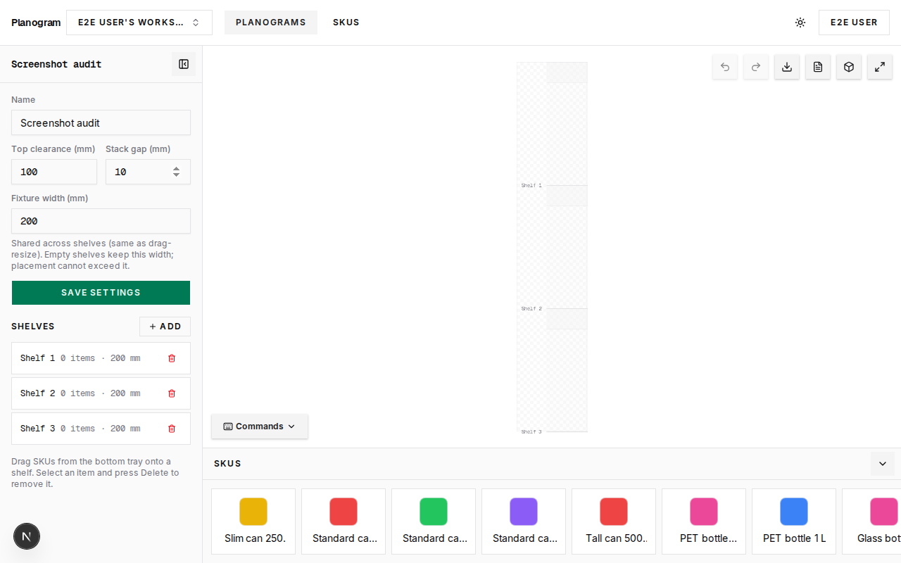
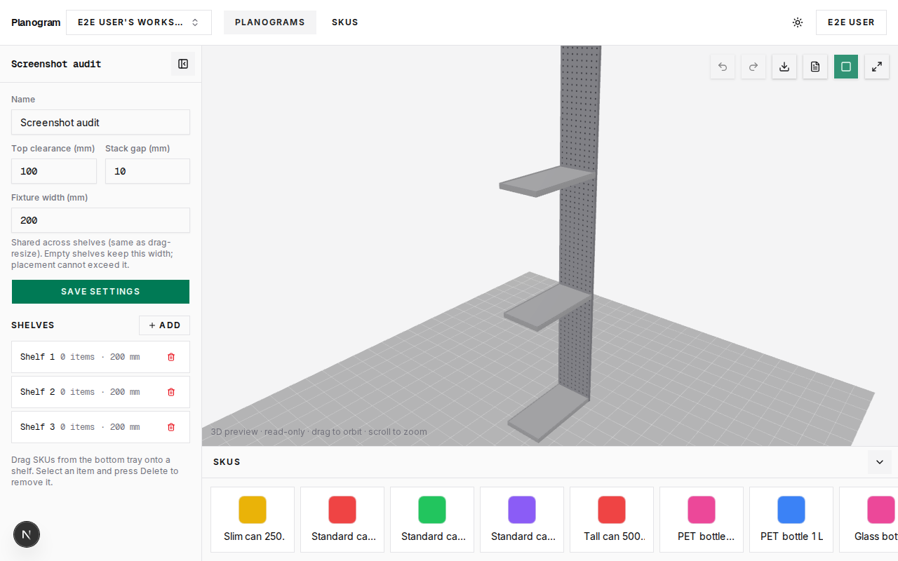
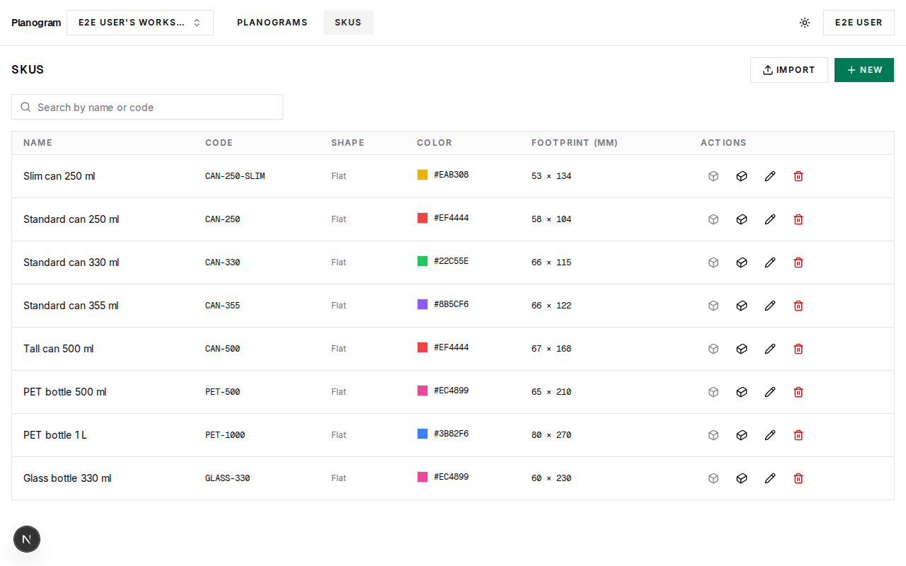
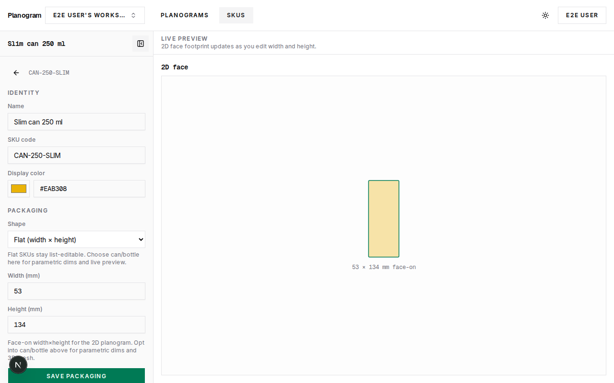
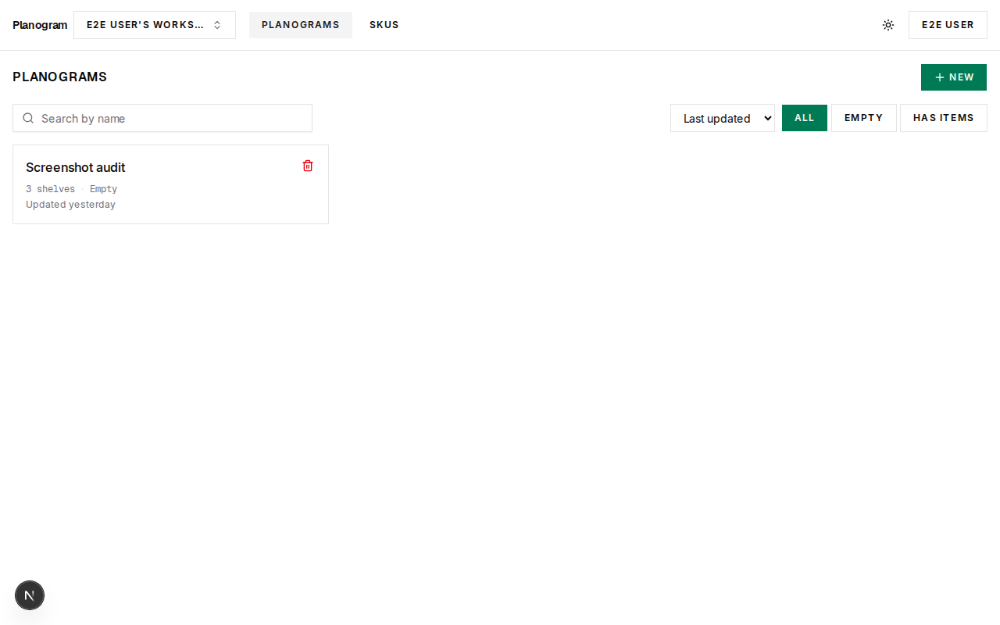
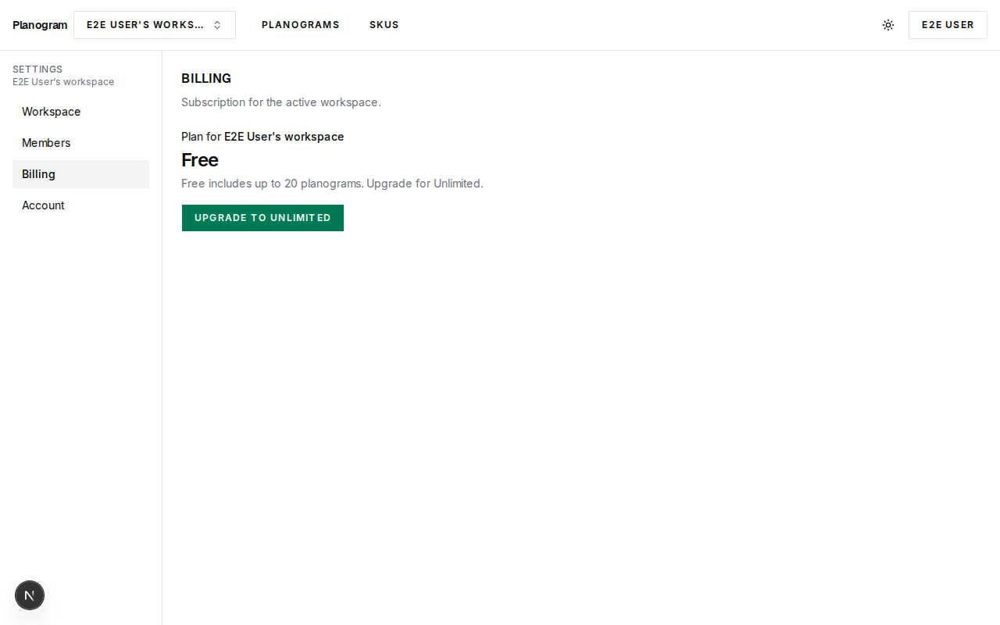

# Planogram

Retail shelf layout editor — place SKUs on shelves in millimeters, adjust facings, and export SVG/PDF.

**Planogram is a vibe-coding project:** built in public, iteratively, with AI-assisted development (Cursor + human review) rather than a waterfall spec. The goal is a real, usable SaaS-shaped app — workspace tenancy, billing hooks, parametric packaging, 2D/3D editors — while learning and shipping in small PRs. Issues and roadmap live in [Linear](https://linear.app/planogram/project/planogram); this repo is intended to be **open source** under the [MIT License](LICENSE).

## Screenshots

Light-theme captures from `pnpm screenshots` (curated in `docs/readme/`).

### Planogram editor (2D)

Drag SKUs from the bottom tray onto shelves; fixture width and shelf settings in the sidebar.



### Planogram editor (3D)

Read-only WebGL preview from the same layout — orbit and zoom in the viewport.



### SKU catalog & packaging editor

Workspace SKU list with import; per-SKU packaging editor with live 2D face preview.

| SKU catalog | Packaging editor |
| --- | --- |
|  |  |

### Planograms & billing

Catalog list and workspace billing (Free / Unlimited upgrade path).

| Planogram list | Billing |
| --- | --- |
|  |  |

## Stack

- Next.js 16 (App Router) + React 19
- PostgreSQL + Prisma 7
- Tailwind CSS 4 + shadcn/ui
- Pure TypeScript placement engine (`lib/planogram-engine`)
- Auth.js · Stripe · Resend · Vercel Blob · Sentry (optional DSN)

## Getting started

```bash
pnpm install
cp .env.example .env   # set DATABASE_URL (+ AUTH_SECRET); on Vercel use pooled URL
# Optional: DATABASE_URL_UNPOOLED for prisma migrate when DATABASE_URL is pooled
pnpm db:migrate
pnpm db:seed
pnpm dev
```

Generate `AUTH_SECRET` with `openssl rand -base64 32`. On Neon/Vercel, set **`DATABASE_URL`** to the pooled connection and **`DATABASE_URL_UNPOOLED`** to the direct URL for migrations (see `.env.example`).

Open [http://localhost:3000](http://localhost:3000).

## Scripts

| Command | Purpose |
|---------|---------|
| `pnpm dev` | Dev server |
| `pnpm lint` | ESLint |
| `pnpm typecheck` | TypeScript (`tsc --noEmit`) |
| `pnpm test` | Vitest unit tests (engine) |
| `pnpm test -- --coverage lib/planogram-engine` | Engine coverage report (see [`docs/ENGINE_COVERAGE.md`](docs/ENGINE_COVERAGE.md)) |
| `pnpm test:e2e` | Playwright smoke (auth, catalogs, settings) + multi-workspace (`e2e/multi-workspace.spec.ts`) |
| `pnpm screenshots` | Full-page UI audit captures (light/dark, editors 2D/3D) → `e2e/screenshots/` — see [`docs/UI_SCREENSHOT_AUDIT.md`](docs/UI_SCREENSHOT_AUDIT.md) |
| `pnpm build` / `pnpm start` | Production build |

First E2E / screenshot run installs Chromium via Playwright:

```bash
pnpm exec playwright install chromium
pnpm test:e2e
# optional UI audit artifacts (dev server on :3000; see docs/UI_SCREENSHOT_AUDIT.md):
pnpm screenshots
```

## CI

GitHub Actions (`.github/workflows/ci.yml`) runs on push/PR:

1. **Quality** — `prisma generate`, lint, typecheck, unit tests
2. **E2E** — Postgres service, migrate, seed, build, Playwright smoke

## Docs

- Roadmap: [Linear — Planogram](https://linear.app/planogram/project/planogram) · [Plan 01 (complete)](https://linear.app/planogram/document/development-plan-product-ux-and-platform-plan-01-bfde90020196) · [Plan 02 (complete)](https://linear.app/planogram/document/development-plan-advanced-product-plan-02-45e4ae89a60f)
- Design system: [`docs/DESIGN_SYSTEM.md`](docs/DESIGN_SYSTEM.md)
- Engine coverage + canvas width checklist: [`docs/ENGINE_COVERAGE.md`](docs/ENGINE_COVERAGE.md)
- Email: [`docs/EMAIL_SETUP.md`](docs/EMAIL_SETUP.md) · [`docs/EMAIL_SMOKE_TEST.md`](docs/EMAIL_SMOKE_TEST.md)
- Billing (test): [`docs/BILLING_SMOKE_TEST.md`](docs/BILLING_SMOKE_TEST.md)
- Stripe live cutover: [`docs/STRIPE_LIVE_GO_LIVE.md`](docs/STRIPE_LIVE_GO_LIVE.md)
- Sentry: [`docs/SENTRY_SETUP.md`](docs/SENTRY_SETUP.md)
- Seed SKUs: [`docs/SEED_SKU_SPECS.md`](docs/SEED_SKU_SPECS.md)
- SKU batch import: [`docs/SKU_IMPORT.md`](docs/SKU_IMPORT.md) · [`docs/examples/sku-import-example.csv`](docs/examples/sku-import-example.csv)
- Parametric can/bottle packaging + editors / planogram 3D: [`docs/SKU_PACKAGING.md`](docs/SKU_PACKAGING.md)
- UI screenshot audit: [`docs/UI_SCREENSHOT_AUDIT.md`](docs/UI_SCREENSHOT_AUDIT.md)
- Blob: [`docs/BLOB_SMOKE_TEST.md`](docs/BLOB_SMOKE_TEST.md)
- Workspace: [`docs/WORKSPACE_MIGRATION.md`](docs/WORKSPACE_MIGRATION.md) · [`docs/WORKSPACE_TENANCY_TEST.md`](docs/WORKSPACE_TENANCY_TEST.md)

## License

[MIT](LICENSE) — SPDX `MIT`. See [`LICENSE`](LICENSE) for the full text.
